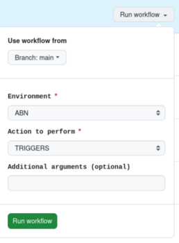
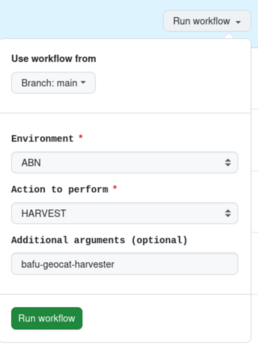

### Harvesting schedule

The harvesting schedule is defined in the file [bulk.json](../../metadata/piveau_triggers/bulk.json).

For each harvester, it defines how often it runs and at what time.
The file can be generated with a tool (the [meta harvester](../../metadata/meta_harvester/)) that
creates an entry for each catalog. The tool configures each harvester to run daily and, to avoid overloading the system, each one is scheduled to start five minutes after the previous one.

The file can be manually edited in case there are specific needs.

The script [triggers.sh](../../metadata/scripts/triggers.sh) is needed to register the schedule in piveau. It must run after any change to the `bulk.json` file and after any restart of the
`piveau-consus-scheduling` service.

To run the script, there is a GitHub Action called [Script Trigger Workflow](https://github.com/opendata-swiss/metadata.swiss/actions/workflows/script-manual-trigger.yaml).

Running the workflow in the chosen environment (`ABN` in the example above) and selecting `TRIGGERS` as the `Action to perform` runs the script and updates the actual schedule.

There is a [dashboard](https://piveau-consus-scheduling.abn.ods.zazukoians.org/dashboard) (it requires authentication) to check the actual schedule.

### Manually running a single harvester

Besides the periodic schedule, it is also possible to manually trigger a harvester.
This is done with the same GitHub Action [Script Trigger Workflow](https://github.com/opendata-swiss/metadata.swiss/actions/workflows/script-manual-trigger.yaml), but choosing `HARVEST` as the `Action to perform`. In this case, it is necessary to also specify the harvester name as an additional argument:

In the example above, the harvester named `bafu-geocat-harvester` is manually triggered.
The steps performed by this harvester are defined in the corresponding JSON file in the pipes
directory ([bafu-geocat-harvester.json](../../metadata/piveau_pipes/bafu-geocat-harvester.json)).

The pipe definition has three steps (segments): the first one is performed by the custom module `piveau-consus-importing-csw`, which retrieves geo-catalog data from the specified `address`.
Other harvesters use the standard module `piveau-consus-importing-rdf` instead.

The second and third segments are the same for all harvesters:

- `piveau-consus-filter` is a custom module to handle licences and other checks specific to opendata.swiss
- `piveau-consus-exporting-hub` is a standard module to ingest the catalog metadata.

Notice that piveau is highly asynchronous, and even when the three segments are complete,
further processing is needed before the ingested data is available in the UI.

### Catalogs

A harvester is meant to retrieve data for a specific catalog, as indicated in the pipe definition (`bafu` in the example above).

Before running a harvester, the corresponding catalog must exist in piveau.
Catalog definitions are stored in the [piveau_catalogues](../../metadata/piveau_catalogues/) directory.

They are generated by the `meta_harvester` tool but they can also be manually edited.

To register catalogs in piveau, another script is needed, available again in `Script Trigger Workflow`.

Running the `CATALOGUES` action without an additional argument registers all catalog definitions in the repository directory in piveau.

Adding an additional argument creates only the specified catalog (assuming a corresponding file is present in the `piveau_catalogues` directory).

There is also a `DELETE_CATALOGUES` action to remove the catalog specified as an additional argument from piveau.

> **⚠️ Warning:** Deleting a catalog is not a lightweight operation, especially if it contains many datasets. Calling `DELETE_CATALOGUES` without an additional argument should delete all catalogues, but
this is extremely heavyweight and strongly discouraged. Other options should be considered to reset an environment.

### Organizations and Custom Vocabularies

`Script Trigger Workflow` includes actions for organizations and (custom) vocabularies.

The pattern is the same: the [piveau_organizations](../../metadata/piveau_organizations/) directory contains organization definitions (possibly created with `meta_harvester`, but also manually curated),
and GitHub Actions invoke a [script](../../metadata/scripts/organizations.sh) to register (or delete) them.

The same pattern applies to [custom vocabularies](../../metadata/piveau_vocabularies/).
The only difference is that custom vocabulary files are created only manually.