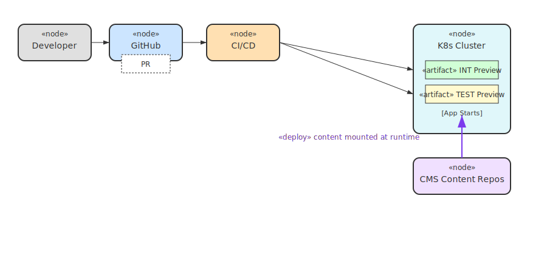
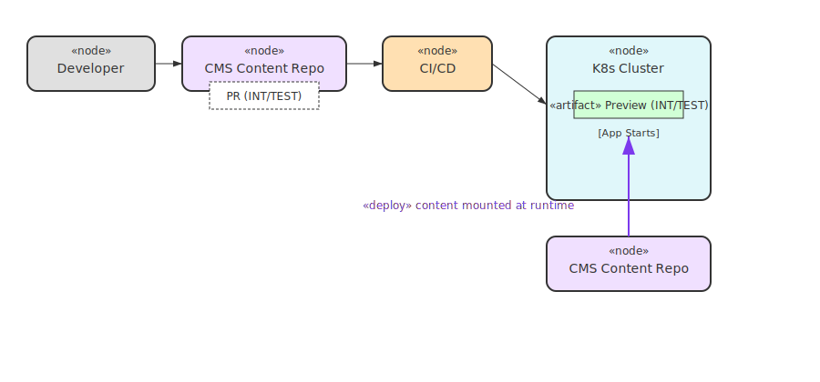

# Nuxt Minimal Starter

Look at the [Nuxt documentation](https://nuxt.com/docs/getting-started/introduction) to learn more.

## Setup

Make sure to install dependencies:

```bash
# npm
npm install

# pnpm
pnpm install

# yarn
yarn install

# bun
bun install
```

Create a `.env` file with required variables:

```bash
NUXT_OAUTH_KEYCLOAK_CLIENT_SECRET:
```

and optionally:

```bash
NUXT_PUBLIC_PIVEAU_HUB_SEARCH_URL=http://localhost:8084
NUXT_PUBLIC_PIVEAU_HUB_REPO_URL=http://localhost:8081
GITHUB_OWNER=opendata-swiss
GITHUB_CMS_REPO=opendata-swiss-cms-content-test
GITHUB_APP_REPO=metadata.swiss
GITHUB_BASE_BRANCH=main
GITHUB_TOKEN=
NUXT_SHOWCASES_MAX_IMAGE_WIDTH=
```

The `*PIVEAU_HUB*` can be overridden to point to another Piveau instance. 
By default, `https://piveau-hub-repo.test.ods.zazukoians.org` is used.

The personal access token requires contents and pull request permissions.

## Development Server

Before running the application for development, clone on of the CMS content repositories into `content`.

1. https://github.com/opendata-swiss/opendata-swiss-cms-content
2. https://github.com/opendata-swiss/opendata-swiss-cms-content-int
2. https://github.com/opendata-swiss/opendata-swiss-cms-content-test

For example, to use TEST content:

```bash
git clone https://github.com/opendata-swiss/opendata-swiss-cms-content-test.git content
```

Start the development server on `http://localhost:3000`:

```bash
# npm
npm run dev

# pnpm
pnpm dev

# yarn
yarn dev

# bun
bun run dev
```

### API tests

To run API tests, set the environment variable below to enable basic auth for the API endpoints:

```bash
NUXT_API_TUNER_TESTS=true
NUXT_PUBLIC_PIVEAU_HUB_SEARCH_URL=http://localhost:8084/
NUXT_PUBLIC_PIVEAU_HUB_REPO_URL=http://localhost:8081/
HUB_REPO_API_KEY=... #value from metadata compose stack 
NUXT_OAUTH_KEYCLOAK_CLIENTS_HUB_REPO_CLIENT_SECRET=...
```

Then, run the tests with:

```bash
npm run dev
npm test
```

## Preview deployments

When pull requests are opened, a preview deployment is automatically created. That applies both to PRs in this repository,
and in the CMS content repositories.

For PR in this repository, two previews get deployed: to INT and TEST. Both will use the latest CMS content from their
respective content repositories.



Pull Requests to the CMS content repositories will trigger a new deployment of the application. That deployment will use the latest code from the `main` branch, and the content from the PR branch.



## Production

Set the environment variables as needed:

- `ENV`
- `NUXT_APP_URL`
- `NUXT_PUBLIC_PIVEAU_HUB_SEARCH_URL`
- `NUXT_PUBLIC_PIVEAU_HUB_REPO_URL`
- `GITHUB_APP_ID`
- `GITHUB_APP_PRIVATE_KEY`
- `GITHUB_APP_INSTALLATION_ID`
- `GITHUB_OWNER`
- `GITHUB_CMS_REPO`
- `GITHUB_APP_REPO`
- `GITHUB_BASE_BRANCH`
- `NUXT_OAUTH_KEYCLOAK_CLIENT_ID`
- `NUXT_OAUTH_KEYCLOAK_CLIENT_SECRET`
- `NUXT_OAUTH_KEYCLOAK_REALM`
- `NUXT_OAUTH_KEYCLOAK_CLIENTS_HUB_REPO_CLIENT_SECRET`
- `NUXT_MATOMO_URL`
- `NUXT_MATOMO_SITE_ID`
- `NUXT_LISTMONK_API_URL`
- `NUXT_LISTMONK_API_USER`
- `NUXT_LISTMONK_API_TOKEN`
- `NUXT_LISTMONK_TEMPLATE_IDS_DE`
- `NUXT_LISTMONK_TEMPLATE_IDS_FR`
- `NUXT_LISTMONK_TEMPLATE_IDS_IT`
- `NUXT_LISTMONK_TEMPLATE_IDS_EN`
- `NUXT_LISTMONK_PREFERENCES_HMAC_KEY`
- `NUXT_PUBLIC_COMMENTS_WEBSITE_ID`
- `NUXT_HYVOR_WEBHOOKS_ENABLED`
- `NUXT_HYVOR_WEBHOOK_SECRET`
- `NUXT_HYVOR_PUBLISHER_NOTIFICATION_TEMPLATE_ID`
- `NUXT_SHOWCASES_MAX_IMAGE_WIDTH`
- `NUXT_SHOWCASES_CATALOG_ID`
- `NUXT_SHOWCASES_RESOURCE_TYPE`

The value for `GITHUB_APP_*` must be that of a GitHub App, installed in the organisation with access to the correct repository.  

Build the application for production:

```bash
# npm
npm run build

# pnpm
pnpm build

# yarn
yarn build

# bun
bun run build
```

Locally preview production build:

```bash
# npm
npm run preview

# pnpm
pnpm preview

# yarn
yarn preview

# bun
bun run preview
```

Check out the [deployment documentation](https://nuxt.com/docs/getting-started/deployment) for more information.

### Decap authentication

To log in to Decap CMS, a GitHub account is required. Authentication is done by Netlify, which uses a GitHub OAuth App.

The Netlify credentials are [here](https://passbolt.zazuko.com/app/passwords/view/df195c98-a453-4532-b3b1-eeccd1028aa1).

In the single Netlify Project, the OAuth App is set up using Client ID and secret. Most importantly, each instance of ODS
must be added in the [Domain Management](https://app.netlify.com/projects/preeminent-flan-064546/domain-management)
section.

### Subscriptions

Subscriptions are managed by [Listmonk](https://listmonk.app) and in the dev environment,
[mailpit](http://localhost:8025) is used to catch all sent emails.

For this configuration to work, make sure to run the [docker compose stack](../metadata/docker-compose.yaml) first.
Then, set the following environment variables before running the dev instance:

```dotenv
NUXT_LISTMONK_API_URL=http://localhost:9000/
NUXT_LISTMONK_API_USER=admin-api
NUXT_LISTMONK_API_TOKEN=
```

The username can be changed [docker-compose.yaml](../metadata/docker-compose.yaml).
The token can be retrieved from [install.sh](../metadata/listmonk/install.sh) produced by listmonk installation script.
