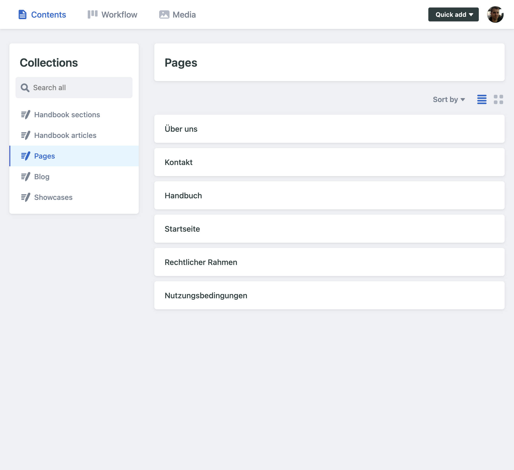

# Content Management System (CMS)

All content which is not handled by Piveau itself is managed via a simple Content Management System (CMS). The CMS is based on [decap](https://decap.org/) (formerly known as Netlify CMS) and allows users to create, edit, and delete content such as showcases, blog posts, and pages.

Additionally, decap handles multilinguality by allowing editors to write content in multiple languages.

## Access

The decap Content Manager can be accessed by opening https://piveau.test.ods.zazukoians.org/admin/. It requires authentication via GitHub. All users can log in but only users with write access to the repository can make changes.

When logged in, users are presented with a list of collections they can manage:

- Blog
- Handbook (divided into sections and articles)
- Pages
- Showcases

The collections are listed in the sidebar on the left. Clicking on a collection opens a list of existing entries in that collection.

## Collections

Each collection is a set of markdown files stored in the repository. Each collection has its own set of fields and configuration options. Decap uses these options to generate forms for creating and editing content.

### Pages

Pages are the static content of the website: home page, "about" pages, etc. They cannot be added or deleted via the CMS, only edited.

[Read more](cms/pages.md)

### Blog

TBD

### Handbook

The handbook is a collection of articles divided into sections. Sections determine the navigation structure of the handbook, resulting in addresses such as `/handbook/section/article` for articles, and `/handbook/section` for section overview pages.

[Read more](cms/handbook.md)

### Showcases

Showcases are the most complex content. In addition to typical fields, they include references to Piveau datasets. They are also possible to submit via a public form.

[Read more](cms/showcases.md)

## Editorial workflow

When viewing a collection, for example Handbook articles, users can create new entries by clicking the "New Handbook article" button. This opens a form with fields defined in the collection configuration.

Additionally, any type of content can be created using a shortcut button "Quick add+" in the header.

The editing form, is divided into two vertical sections. The left section always displays the editing form, with content in the selected language. The right section can be switched between editing a second language, or previewing the content.

When saved, changes are committed to a new branch in the repository, and a pull request is automatically created. Decap-managed Pull Requests are also displayed in the Content Manager on the "Workflow" screen. There, work-in-progress content can be moved between "Draft", "In Review", and "Ready" states. They can also be deleted completely and published, when in the "Ready" state.

## Rendered content

Most pages on the website follow a similar structure, with a title, subtitle, short lead, main content, and optional sidebar.

On most pages, the sidebar shows a table of contents generated from headings in the main content.
