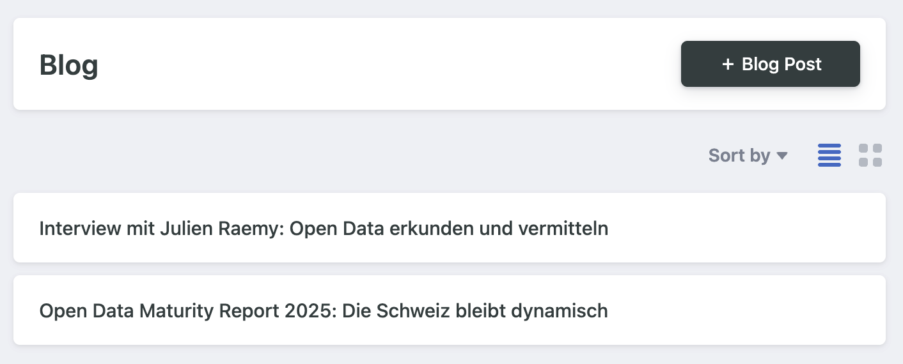

# Blog

Blog posts are managed in Decap CMS as a single collection. Each entry represents one article that appears on the blog listing and on its own detail page.

## Fields (as configured in Decap/Nuxt Content)

- Title (string)
  - The main title of the post. Displayed on the card and the article page.
- Pinned (boolean)
  - Marks a post as featured. Pinned posts are prioritized in listings where supported by the UI.
- Slug (string, optional)
  - Lowercase letters, numbers and hyphens only. This becomes the URL segment. If left empty, it will be derived from the file name.
- Date (date, optional)
  - Publication date. Used for sorting. If omitted, the file’s timestamp or default sorting may be used.
- Sub heading (string, optional)
  - Short subtitle shown under the title where supported by the UI.
- Image
  - Lead image shown on the card and article page.
- Body (markdown)
  - The content of the article.

## Location and URLs

- Source files live under `content/blog/*.md` (and optionally `content/.test/blog/*.md` or `content/.local/blog/*.md` during development).
- Each post is accessible at `/blog/<slug>`.
  - If `slug` is not set, it is derived from the file name.

## Sorting and featured posts

- Listings typically sort by `date` (newest first). If `date` is not set, the fallback depends on the implementation (often file creation time or title).
- Pinned posts may be shown first or in a dedicated “featured” area depending on the page.

## Example: a blog post entry

- Title: Neues im Portal
- Pinned: false
- Slug: `neues-im-portal`
- Date: 2026-07-30
- Sub heading: Die wichtigsten Neuerungen auf einen Blick
- Image: `/images/blog/neues-im-portal.jpg`
- URL: `/blog/neues-im-portal`

Notes
- Keep `Slug` short, lowercase, and descriptive; avoid special characters.
- Always set an `Image` so the post renders correctly in cards and previews.
- Use `Pinned` sparingly to highlight only a few key posts.
