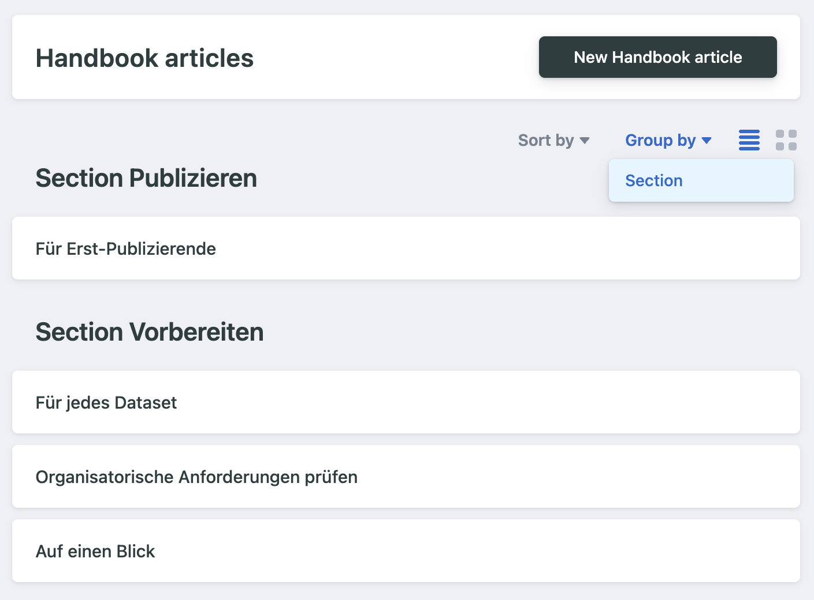

# Handbook

Handbook is a collection of articles divided into sections. Both are managed as an individual collection in Decap CMS.

## Sections

Sections are separate published pages which group articles together. In decap, make sure to select the grouping so that related articles are displayed together.

## Articles

Articles are the individual entries in the handbook. Each article belongs to a section, which determines its URL and navigation placement.

### Fields

In addition to section and the standard content fields, handbook articles have two special fields.

#### Breadcrumb title

Overrides the breadcrumb text on the top of the page. If not set, the main title is used.

#### Permalink

Permalinks have a special purpose of defining the URLs strucutre of the handbook and the construction of breadcrumbs. It's best explained on an example of multiple articles in the section "Vorbereiten":

1. Page "Für jedes Dataset"
   - Breadcrumb Title: Dataset
   - Permalink: `dataset`
   - URL: `/handbook/vorbereiten/dataset`
   - Breadcrumbs: `Handbuch > Vorbereiten > Dataset`
2. Page "Organisatorische Anforderungen prüfen"
   - Breadcrumb Title: (empty)
   - Permalink: `dataset/organisatorischer-check`
   - URL: `/handbook/vorbereiten/dataset/organisatorischer-check`
   - Breadcrumbs: `Handbuch > Vorbereiten > Dataset > Organisatorische Anforderungen prüfen`

The permalink defines the full path segment after the section. It can include slashes to create sub-levels within the section.
The breadcrumbs are by constructed by matching each segment with permalinks of other articles in the same section. If a matching article is found, its breadcrumb title (or main title if empty) is used in the breadcrumb trail.
