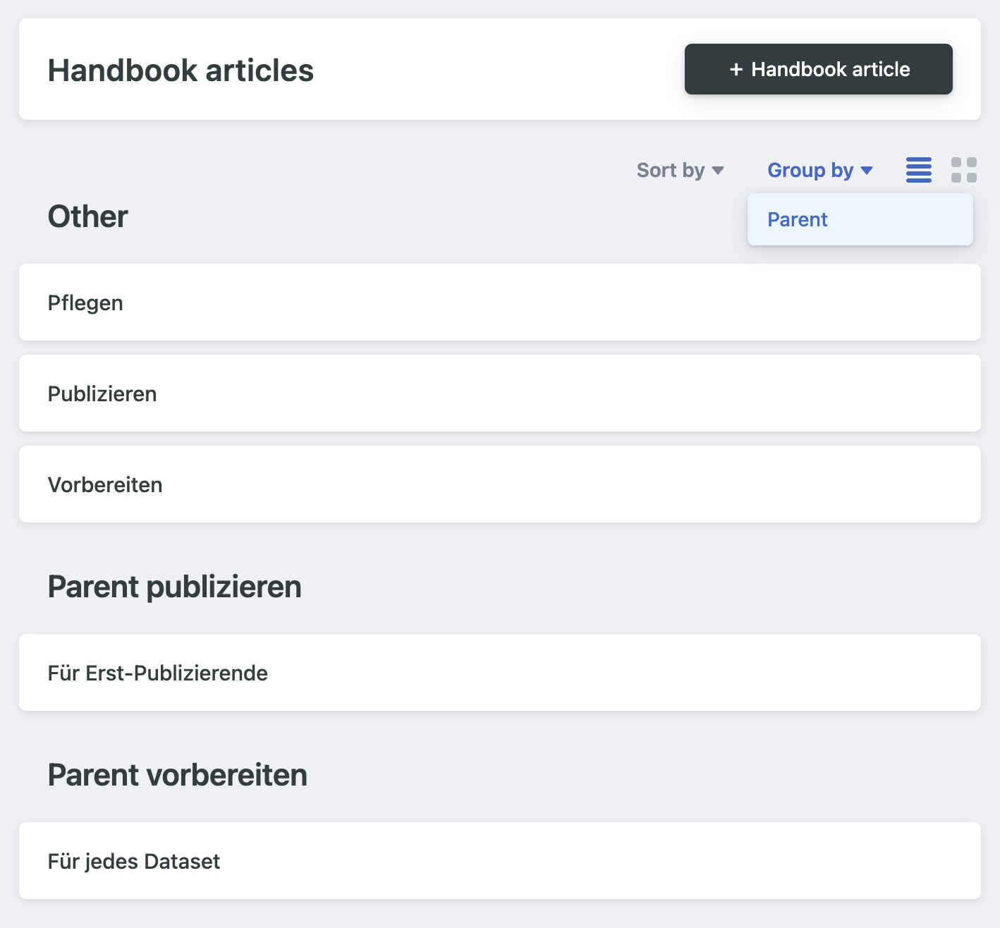

# Handbook

The Handbook is managed as a single collection in Decap CMS. All entries (both sections and articles) live in the same collection and are organized using the fields described below.

## Structure: sections and articles

- A section is simply a top‑level handbook entry (no parent selected). It groups related child articles under it.
- An article can optionally reference another handbook entry as its parent. This creates the hierarchy and determines the URL and breadcrumb trail.

## Fields (as configured in Decap)

- Active (boolean)
  - Controls whether the entry is visible. Leave on (default) to publish; turn off to hide without deleting.
- Title (string)
  - The main title shown on the page and in lists.
- Breadcrumb title (string, optional)
  - Overrides the breadcrumb label. If empty, the main Title is used.
- Slug (string)
  - Lowercase letters, numbers and hyphens only. This is the URL segment for the entry.
- Parent article (relation, optional)
  - Select another handbook entry to nest under it. Top‑level sections have no parent.
- After (relation, optional)
  - Optional ordering hint. When set, the entry is placed after the selected sibling within the same parent.
- Body (markdown)
  - The content of the page.

## URLs and breadcrumbs

The URL is built by joining the `slug` of the entry and all of its parents, in order, under `/handbook`.

Example: a section entry

- Entry: "Vorbereiten" (section)
  - Breadcrumb title: (optional — if empty, uses Title)
  - Slug: `vorbereiten`
  - Parent: (none — top‑level section)
  - URL: `/handbook/vorbereiten`
  - Breadcrumbs: `Handbuch > Vorbereiten`

Example in the section "Vorbereiten":

1. Entry: "Für jedes Dataset"
   - Breadcrumb title: Dataset
   - Slug: `dataset`
   - Parent: (none — this is the section)
   - URL: `/handbook/vorbereiten/dataset`
   - Breadcrumbs: `Handbuch > Vorbereiten > Dataset`
2. Entry: "Organisatorische Anforderungen prüfen"
   - Breadcrumb title: (empty)
   - Slug: `organisatorischer-check`
   - Parent: `dataset`
   - URL: `/handbook/vorbereiten/dataset/organisatorischer-check`
   - Breadcrumbs: `Handbuch > Vorbereiten > Dataset > Organisatorische Anforderungen prüfen`

Notes
- Use `Breadcrumb title` to provide short labels for long page titles in the breadcrumb trail.
- Keep `Slug` short, lowercase, and descriptive; it forms part of the URL and is also used to resolve parent/child relationships.
