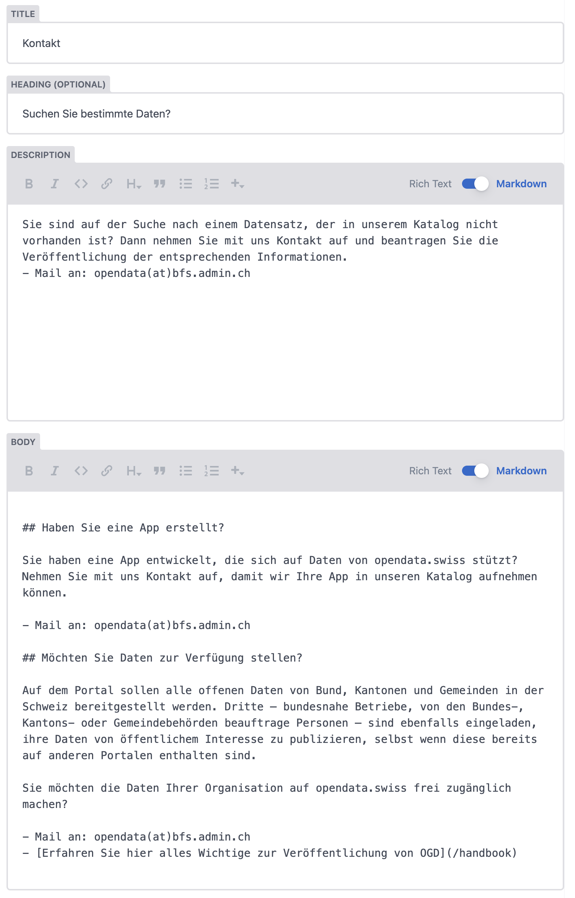

# Pages

Pages represent static and informational content across the website, such as the home page, "about" pages, guidelines, or other custom standalone pages. They are managed in Decap CMS as the `Pages` collection.

## Fields

- Title (`title`, string, required)
  - The main title of the page. Used as the browser tab and SEO title (`<title>`), in navigation menus, and as the default header title in the hero banner if Heading is not provided.
- Heading (`heading`, string, optional)
  - Optional header title, displayed in the Hero banner at the top of the page. When set, it overrides `Title` in the visual hero banner.
- Subheading (`subHeading`, markdown, optional)
  - Short subtitle/lead text, displayed in the Hero banner below the heading. Supports markdown formatting.
- Image displayed on the top of the page (`heroImage`, image, optional)
  - Optional lead/hero image, displayed in the banner at the top of the page.
- Parent page (`parent`, relation, optional)
  - Select another page to nest this page under in the main navigation menu. Top-level pages have no parent selected.
- Show in the main menu (`mainMenu`, boolean, optional, default: true)
  - Controls whether the page appears in the "More" dropdown menu in the header navigation. Turn off for unlisted or standalone pages.
- Disables sidebar (`fullWidth`, boolean, optional, default: false)
  - When enabled (`true`), disables the sidebar (Table of Contents) and renders the content across the full width of the container. When disabled (`false`), a sidebar with an auto-generated Table of Contents from headings is displayed.
- After (`after`, relation, optional)
  - Optional ordering hint. Specifies which sibling page this entry should appear after in navigation menus.
- Body (`body`, markdown)
  - The main content of the page, written in Markdown.

## Location and URLs

- Source markdown files are stored under `content/pages/*.md` (localized files such as `index.de.md`, `about.fr.md`, etc.).
- Each page is accessible by its slug at `/<slug>`:
  - The home page is defined by the `index` slug and is accessible at `/`.
  - Other pages are accessible at their root path, e.g. `/about` or `/guidelines`.

## Menu navigation and hierarchy

Pages can be structured in the main header navigation under the "More" dropdown:
- **Top-level pages**: Pages with `Show in main menu` enabled and no `Parent page` selected appear directly as items in the "More" dropdown menu.
- **Nested pages**: Selecting a `Parent page` places the page as a child item in the submenu of that parent.
- **Menu order**: Use the `After` field to order items relative to other pages within the same menu level.

## Layout and Table of Contents

- By default (`Disables sidebar` is off), pages are rendered with a two-column layout: the main content on the left and a sticky sidebar on the right containing an auto-generated Table of Contents (TOC) derived from headings in the `Body`.
- When `Disables sidebar` (`fullWidth`) is turned on, the page renders full-width without the sidebar TOC. This is suitable for landing pages or content that does not require section-by-section navigation.

## Example: a page entry

- Title: Über uns
- Heading: Über opendata.swiss
- Sub-heading: Die zentrale Plattform für offene Verwaltungsdaten in der Schweiz.
- Image displayed on the top of the page: `/cms/hero-about.jpg`
- Parent page: (none — top-level entry)
- Show in main menu: true
- Disables sidebar: false
- After: (none)
- URL: `/about`

Notes
- Use `index` for the home page content.
- Use `Heading` and `Sub-heading` to customize the hero banner appearance while keeping `Title` concise for browser tabs and navigation.
- If a page has multiple sections with headings (`##`, `###`), keep `Disables sidebar` turned off so users can navigate using the auto-generated Table of Contents.

