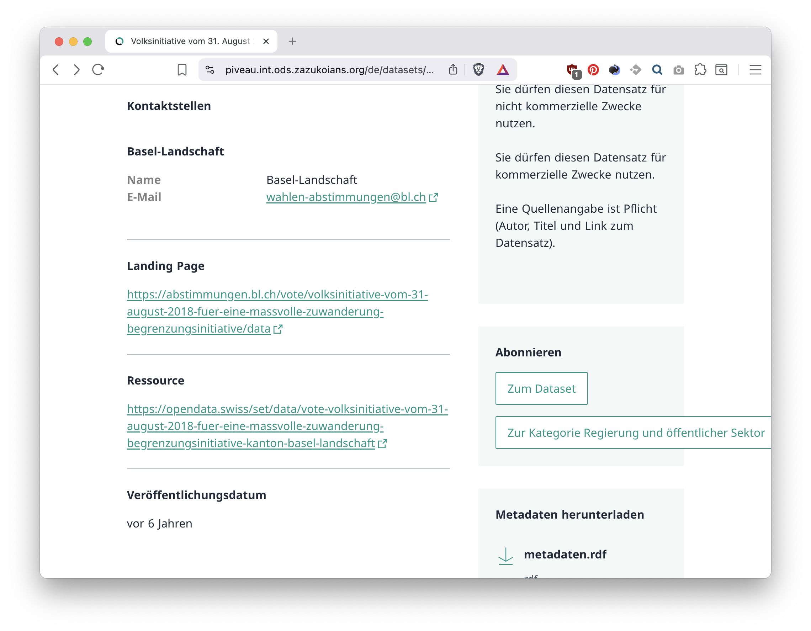
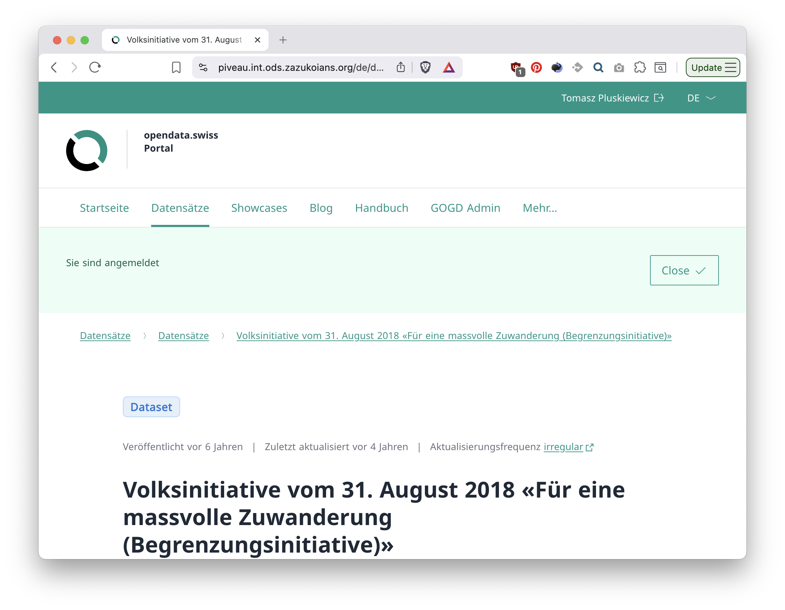
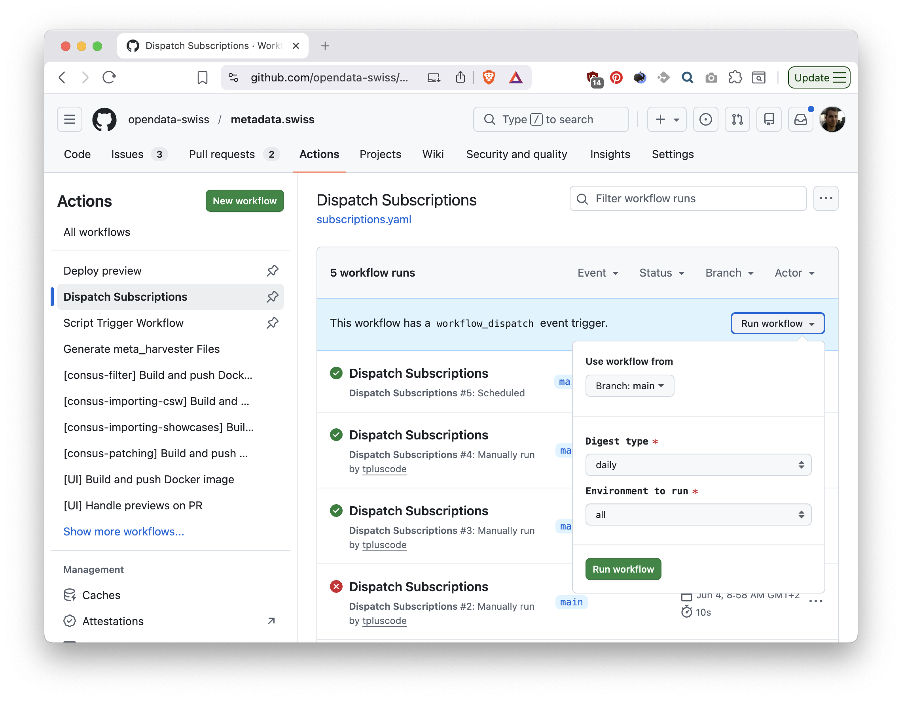
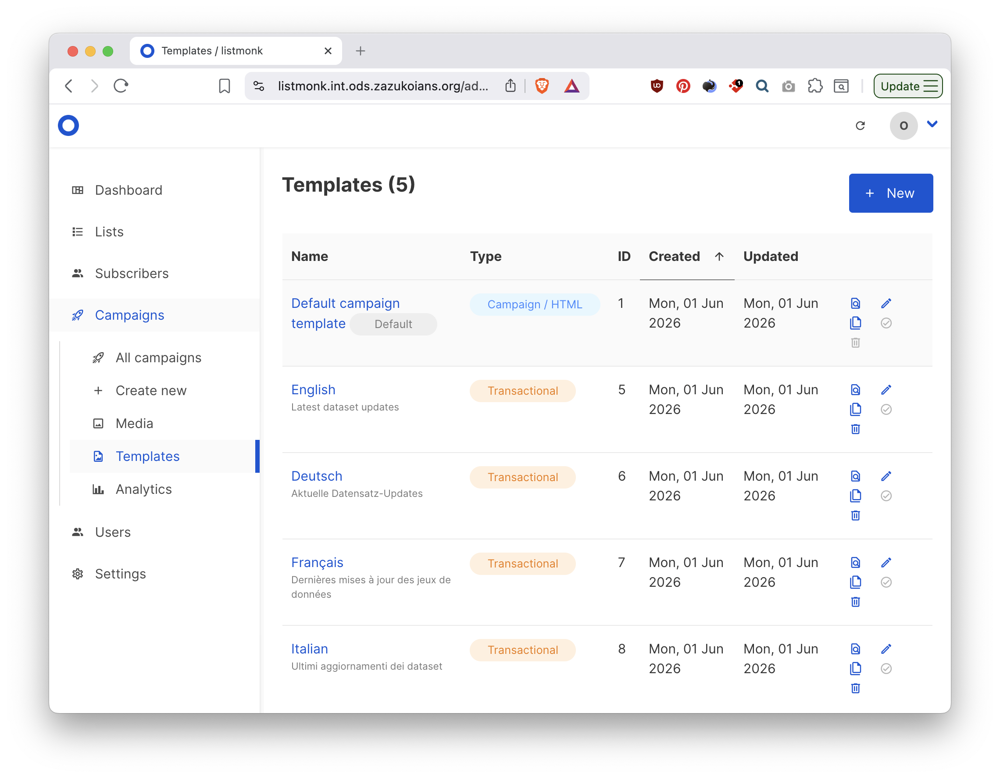
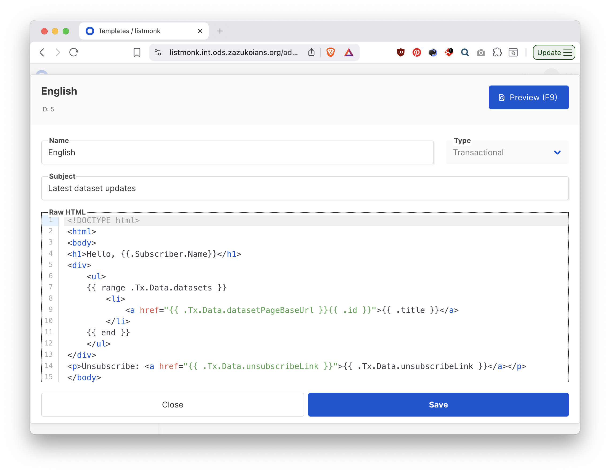
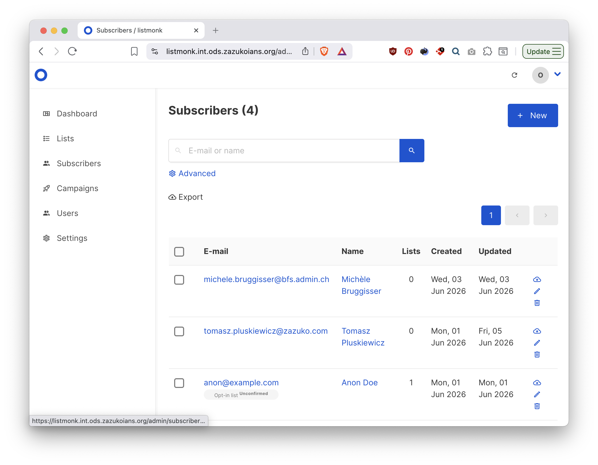
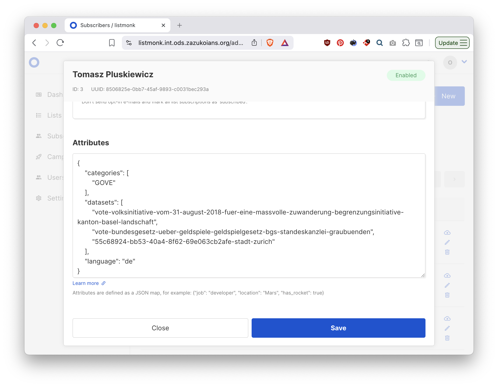
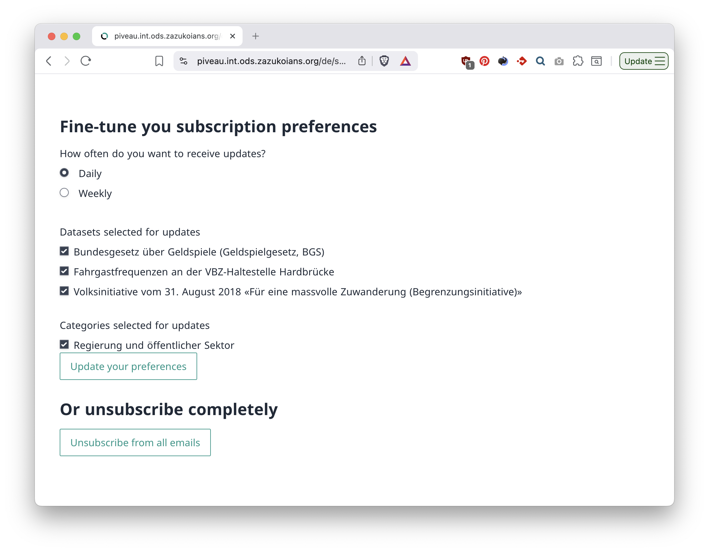

# Dataset subscriptions

Below, I present the feature of subscribing to dataset changes.

## Subscribe

On a dataset page, scroll down until you find the "Subscribe" box on the right-hand side. There, you will find a button to subscribe to this specific dataset or one of its categories, if any. Work on subscribing to organizations is ongoing.

Click it to subscribe. Once successful, you will see confirmation on the top.

> Subscribing requires users to be logged in, thus clicking these buttons may first redirect to the login page. Once logged in, click again

### Schedules and manual trigger

Both environments are automatically sending notifications every day (latest 24 hrs) and every week to subscribed users.

It is also possible to use GitHub's interface to manually send emails on demand. To do that, first go to the [workflow page](https://github.com/opendata-swiss/metadata.swiss/actions/workflows/subscriptions.yaml). The `Run workflow` button opens a dropdown where you choose the modification window and optionally environment before running.

### Managing the templates and subscribers

The subscriptions are managed by a service called Listmonk. You can access the ABN instance by opening https://listmonk.int.ods.zazukoians.org. I created an account for Michele who would be able to add more users or I can also do that if needed.

Listmonk has two main points of interest: templates and subscribers.

Templates, accessed by expanding the `Campaigns` menu on the left are compiled to HTML email bodies based sent to subscribers. There is one for each language, selected based on the user's preferences.

> The language selected initially will be the one in which the website was showing when a user first clicks a button to subscribe.

You can edit the templates using a slightly technical syntax. The exact data required to compile a template is up for discussion. Presently, it's a list of datasets that matched a user's preferences, limit to 100. That number is configurable per environment, although a per-user option could be adopted if it makes sense.

Finally, the list of subscribers lets admins inspect their preferences, stored as JSON in the `Attributes`. A subscriber can also be manually disabled. Users get to edit their preferences (or unsubscribe completely) by following a link from the email.

### Self-service preference management

Following the `unsubscribe` link from the email opens a form where users can view and change their current subscription. It does not require to be logged in prior.

